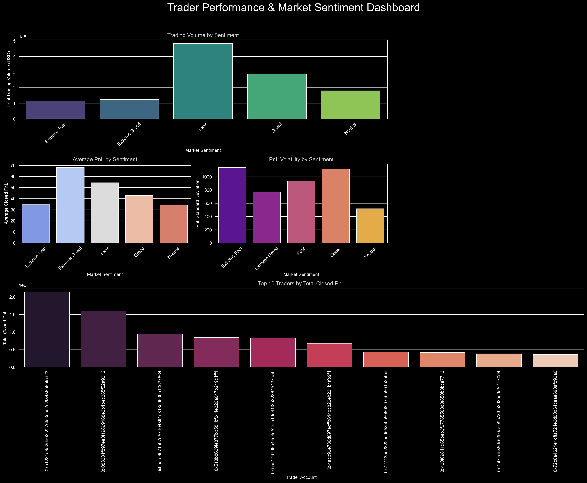

# 📊 Trader Behavior & Market Sentiment Analysis

## 📌 Problem Statement

Understanding how trader behavior changes with market sentiment (Fear vs Greed) is crucial for making better trading decisions.
This project analyzes historical trading data along with the Bitcoin Fear & Greed Index to uncover behavioral patterns.

---

## 📂 Dataset

* Bitcoin Fear & Greed Index
* Historical trader data (price, position, leverage, PnL)

---

## 🔍 Approach

* Data cleaning and preprocessing
* Merging sentiment data with trading activity
* Exploratory Data Analysis (EDA)
* Behavioral pattern analysis

---

## 📊 Dashboard Preview

---

## 📈 Key Insights

* 📊 Traders take **higher risks during “Greed” periods**
* ⚠️ Increased leverage leads to **higher volatility in returns**
* 📉 Fear phases show **more conservative trading behavior**
* 💰 Profitability varies significantly with market sentiment

---

## 🛠 Tools Used

* Python
* Pandas
* NumPy
* Matplotlib / Seaborn

---

## 🎯 Outcome

This analysis helps in understanding trader psychology and can support smarter trading strategies and risk management decisions.
